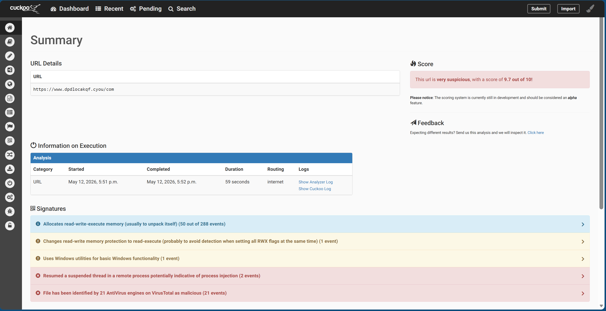

# Threat Analysis Report — DPD Phishing

**Author:** Joby Barnaby  
**Date:** 12/05/2026  
**Severity:** High  
**Type:** SMS  
**Status:** Complete

---

## Overview

This report documents the analysis of a suspicious URL received via a phishing message impersonating DPD UK, a legitimate parcel delivery service. The message claimed a delivery had been rescheduled and prompted the recipient to follow a link to confirm their details. The URL was submitted to a sandbox environment for behavioural analysis.

---

## Indicator of Compromise (IOC)

| Type | Value |
|------|-------|
| URL | `hxxps://www.dpdlocakqf[.]cyou/com` |
| Domain | `dpdlocakqf[.]cyou` |
| IP Address | `N/A` |
| File Hash (MD5) | `N/A` |
| File Hash (SHA256) | `N/A` |

---

## Why It Is Suspicious

- [x] Suspicious domain name / typosquatting
- [x] Unusual TLD (e.g. .cyou, .xyz, .top)
- [x] Impersonating a legitimate brand
- [x] Flagged by multiple AV engines
- [x] Suspicious URL structure

**Notes:**

The message was received at 17:45 on 04/05/2026 from the address `lindadavidson6243@gmail.com`. A legitimate DPD notification would never originate from a personal Gmail address. The message was treated with suspicion as no parcels had been ordered. Further red flags included the structure of the URL and the unusual instructions provided on how to interact with it.

---

## Phishing Message Sample

> ⚠️ The following is a malicious phishing message captured for analysis purposes only.

---

**Subject:** DPD UK - Pending Delivery Notification

**Body:**

> This is a follow-up concerning your package currently in transit.
> Our driver, Daniel Hughes (ID: 153927), tried to deliver your parcel
> yesterday at 3:15 PM. Delivery remains pending because a signature is
> necessary and the address information requires a quick review.
>
> Please confirm your shipping details and set your delivery requirements
> within 24 hours via this protected link:
> `hxxps://www.dpdlocakqf[.]cyou/com`
>
> Simply reply with "Y" and refresh your page to proceed. If the link is
> inaccessible, please copy and paste the address directly into your browser.

---

## Social Engineering Techniques Used

| Technique | Example from Message |
|-----------|----------------------|
| Urgency / deadline | "within 24 hours", "by 5th May" |
| Fake authority | Fabricated driver name and ID (Daniel Hughes, ID: 153927) |
| Fear of consequence | "item will be processed for return to sender" |
| Legitimacy spoofing | Mimics real DPD delivery notification format |
| Suspicious CTA | "Simply reply with Y and refresh your page" |

---

## Analysis — Cuckoo sandbox

**Tool used:** Cuckoo sandbox  
**Analysis date:** 12/05/2026  
**Score:** 9.7 / 10 (Very Suspicious)  
**Routing:** Internet  

### Key Findings

**Suspicious Behaviour Detected:**
- [x] Memory manipulation (PAGE_EXECUTE_READWRITE)
- [x] Process injection
- [ ] Anti-analysis / evasion techniques
- [ ] Suspicious file writes
- [ ] Network connections
- [ ] Other: ___

### Behaviour Breakdown

**Processes observed:**

| PID | Process | Notes |
|-----|---------|-------|
| 1900 | iexplore.exe | Main process — opened the URL |
| 2796 | iexplore.exe | Spawned child process — injected into |

**Memory activity:**
> Multiple calls to `NtProtectVirtualMemory` and `NtAllocateVirtualMemory` were observed, setting memory regions to `PAGE_EXECUTE_READWRITE` (protection value 64). This allows code to be written and executed in the same memory region — a common technique used to unpack or inject malicious code at runtime.

**Process injection:**
> Process 1900 (iexplore.exe) resumed a suspended thread in remote process 2796 (iexplore.exe) via `NtResumeThread`. This is indicative of process injection — malicious code was likely written into the child process before resuming its thread to execute it.

**Files written:**
> No file writes observed during analysis.

**Network activity:**
> URL submitted directly — `hxxps://www.dpdlocakqf[.]cyou/com`. No additional hosts or DNS lookups recorded in this analysis.

### AV Detection

Flagged by **21/21 AV engines** on VirusTotal — all classify as phishing or malicious site.

| Engine | Classification |
|--------|----------------|
| Kaspersky | Phishing site |
| BitDefender | Phishing site |
| ESET | Phishing site |
| Sophos | Phishing site |
| Google Safebrowsing | Phishing site |
| Fortinet | Phishing site |
| Emsisoft | Phishing site |
| Gridinsoft | Phishing site |
| Criminal IP | Phishing site |
| Netcraft | Malicious site |
| Webroot | Malicious site |
| ADMINUSLabs | Malicious site |
| Seclookup | Malicious site |

### Screenshots

---

## MITRE ATT&CK Mapping

| Technique ID | Technique Name | Observed |
|--------------|----------------|----------|
| T1566 | Phishing | URL designed to impersonate legitimate brand via SMS/email |
| T1055 | Process Injection | PID 1900 injected into PID 2796 via `NtResumeThread` |
| T1562 | Impair Defences | Memory protection changed in two steps to avoid triggering RWX detection |

> Full MITRE ATT&CK framework reference: https://attack.mitre.org

---

## Conclusion

The URL received via phishing message was confirmed malicious across all tools used in this analysis. Any.run sandbox scored it 9.7/10 and identified active memory manipulation and process injection behaviour — unusual for a purely credential-harvesting phishing page, suggesting the site may attempt to execute code in the browser. All 21 VirusTotal AV engines flagged it as a phishing or malicious site. The domain `dpdlocakqf[.]cyou` is clearly designed to impersonate DPD UK and should be treated as a high-confidence threat.

---

## Recommendations

- Do not visit this URL on any real device
- Block the domain at DNS / firewall level: `dpdlocakqf[.]cyou`
- Report the sender address to Google as abuse
- Report to DPD UK directly so they are aware of impersonation
- Submit to Google Safe Browsing: https://safebrowsing.google.com/safebrowsing/report_phish/
- Report to the NCSC if in the UK: https://www.ncsc.gov.uk/section/about-this-website/report-scam-website

---

## References

- cuckoo sandbox: https://sandbox.pikker.ee
- VirusTotal: https://virustotal.com
- MITRE ATT&CK: https://attack.mitre.org
- NCSC Phishing Reporting: https://www.ncsc.gov.uk

---

*Report produced as part of independent security research for educational purposes.*
